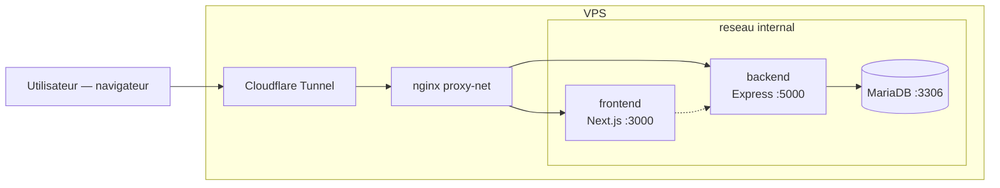
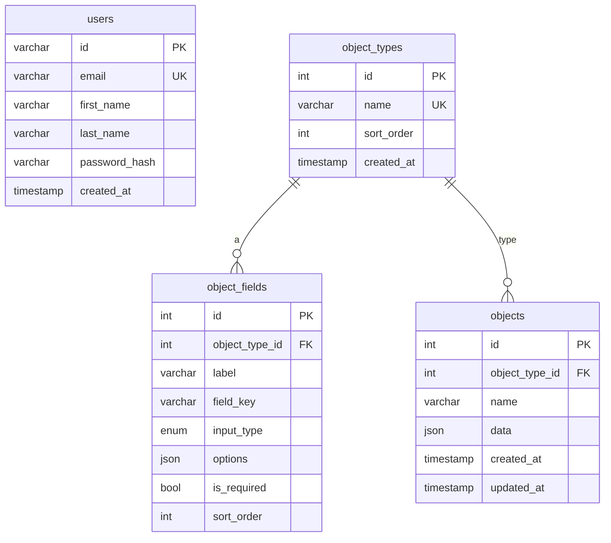
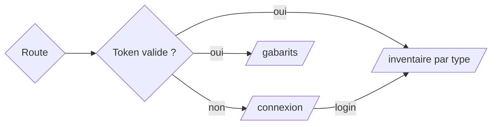

# Inventory-IT — Documentation technique

Application web d'inventaire du parc informatique de l'Ensemble Scolaire Jean-XXIII.
Monorepo : backend `Express` + `MariaDB`, frontend `Next.js`, déployé sur le VPS
via Docker et exposé par Cloudflare Tunnel.

## 1. Architecture

- Le frontend appelle l'API uniquement via `NEXT_PUBLIC_API_URL` (URL publique,
  ex. `https://inventory-it.2025.jeanxxiii.net/api`).
- En production, les trois conteneurs vivent sur un réseau interne (`internal`),
  seule nginx accède aux ports applicatifs, via le réseau externe `proxy-net`.

## 2. Base de données

- `objects.data` est un JSON libre validé côté backend contre le gabarit du type
  (`object_fields`) : clés inconnues rejetées, format validé par `input_type`
  (`text`, `number`, `date`, `mac`, `ip`, `select`, `boolean`) et champs
  obligatoires (`is_required`) contrôlés.
- `init.sql` fournit le schéma + le seed des 6 types : Switch, Écran, Serveur,
  Ordinateur, Clavier, Souris. Les tables `object_types` / `object_fields` sont
  déclarées avec un `AUTO_INCREMENT` de départ (7 et 36) : les champs du seed
  prennent donc les `id` 36-76, le premier champ créé ensuite reçoit le `id` 77.
- Suppression d'un type : `ON DELETE CASCADE` détruit ses objets et ses gabarits.

## 3. API REST

Toutes les routes sauf `/api/auth/login` exigent le header
`Authorization: Bearer <jwt>` (JWT signé via `JWT_SECRET`).

| Méthode | Route                     | Description                                  |
| ------- | ------------------------- | -------------------------------------------- |
| POST    | `/api/auth/login`         | Connecte par e-mail, retourne `{ token, user }` |
| GET     | `/api/auth/me`            | Compte courant (valide le token)             |
| PUT     | `/api/auth/profile`       | Modifie l'e-mail du compte                   |
| PUT     | `/api/auth/password`      | Modifie le mot de passe (vérifie l'actuel)   |
| GET     | `/api/users`              | Liste des comptes (sans `password_hash`)     |
| POST    | `/api/users`              | Crée un compte (prénom + nom + e-mail, mdp temporaire envoyé par e-mail) |
| DELETE  | `/api/users/:id`          | Supprime un compte (auto-suppression refusée) |
| GET     | `/api/types`              | Types + champs du gabarit                    |
| POST    | `/api/types`              | Crée un type                                 |
| PUT     | `/api/types/reorder`      | Réordonne tous les types (`ids` = ordre final) |
| PUT     | `/api/types/:id`          | Renomme / décrit un type                     |
| DELETE  | `/api/types/:id`          | Supprime type + objets + gabarit (cascade)   |
| POST    | `/api/types/:id/fields`   | Ajoute un champ au gabarit                   |
| PUT     | `/api/types/:id/fields/reorder` | Réordonne les champs du gabarit (`ids` = ordre final) |
| PUT     | `/api/fields/:id`         | Modifie un champ                             |
| DELETE  | `/api/fields/:id`         | Supprime un champ                            |
| GET     | `/api/objects?typeId=`    | Tous les objets (filtrés par type si fourni) |
| POST    | `/api/objects`            | Crée un objet (`object_type_id`, `name`, `data`) |
| PUT     | `/api/objects/:id`        | Modifie `name` / `data`                      |
| DELETE  | `/api/objects/:id`        | Supprime un objet                            |

### Gestion d'erreur

- Erreurs métier : `AppError` (statut HTTP + champ `error`).
- Erreurs imprévues : 500 « Erreur interne de la base de données. » sans fuite de
  détail vers le client.

### Ordre et réordonnancement

- `sort_order` (types et champs) n'a **pas** de contrainte UNIQUE : les rangs sont
  libres, l'unicité visuelle vient du réordonnancement global.
- Dans l'UI, l'ordre ne se modifie **que** par drag & drop (colonne poignée avec
  `drag.webp`) ; il n'est plus un champ éditable. Un nouveau type/champ reçoit
  `sort_order = <count> + 1`.
- `PUT /api/types/reorder` et `PUT /api/types/:id/fields/reorder` appliquent le
  réordonnancement complet en **une seule transaction** : renumérotation
  séquentielle `1..n` (n est petit — quelques types, quelques champs). C'est
  l'approche standard pour ce volume : évite les `UPDATE` en parallèle (le
  `Promise.all` d'autrefois causait des deadlocks `ER_LOCK_DEADLOCK` sur les roués
  chevauchés → 500) et reste atomique.
- `PUT /api/types/:id` et `PUT /api/fields/:id` gardent l'échange anti-doublons
  (`FOR UPDATE`) pour les usages ponctuels de l'API.

## 4. Frontend

### Pages

- **`/`** — inventaire : un panneau par type (DataTable + graphiques SVG maison
  réactifs à la recherche), barre d'onglets fixe hors du conteneur de scroll,
  en-têtes de colonnes sticky dans chaque DataTable, rechargement au focus,
  édition inline (récupération du champ MAC via le double-clic). La modification
  et la suppression d'un objet sont **optimistes** : appliquées à l'écran puis
  persistées après 3 s, avec toast « Annuler » (temps de rétractation).
- **`/connexion`** — connexion (e-mail + mot de passe + JWT). Les comptes sont
  créés depuis `/utilisateurs` ou via le script `backend/scripts/add-user.ts`
  exécuté dans le conteneur backend (`docker exec`).
- **`/utilisateurs`** — création et liste des comptes (prénom, nom, e-mail,
  DataTable avec recherche et tri, skeleton pendant le chargement) : `POST /api/users`
  génère un mot de passe temporaire qui est envoyé par e-mail (SMTP) ou renvoyé
  dans la réponse si SMTP est absent ; suppression avec confirmation,
  auto-suppression bloquée côté API.
- **`/gabarits`** — gestion des types et de leurs champs (création, renommage,
  suppression avec rétractation). L'ordre est géré **uniquement** en **drag &
  drop** : une colonne poignée (`drag.webp`) en tête de chaque ligne signale que
  c'est déplaçable, et le réordonnancement global est poussé en une requête
  (`/types/reorder`). Un simple clic sur une ligne sélectionne le type (ligne
  surlignée) ; l'ordre n'est plus modifiable via le formulaire d'édition. La page
  a une **hauteur fixe sur desktop** : les listes défilent en interne (en-têtes
  sticky), sans scroller la page entière.
- **`/profil`** — compte connecté : modification de l'e-mail et du mot de passe
  (change l'e-mail via `PUT /api/auth/profile`, le mot de passe via
  `PUT /api/auth/password`).

### État

- `useInventory` charge `types` + `objects` et expose les opérations CRUD
  (création immédiate ; modification/suppression **optimistes**) avec
  rechargement après persistance.
- `useUndo` : machine d'annulation partagée (snapshot, mutation optimiste,
  persistance différée 3 s, rollback au clic « Annuler » ou en cas d'échec API).
- `useSearch` / `useSort` partagés entre les panneaux (filtre par objet, colonne,
  type).
- `RefreshButton` : bouton d'actualisation avec rotation de l'icône pendant et
  après le chargement (composant réutilisé sur `/`, `/gabarits`, `/utilisateurs`).
- `DataTable` générique : scroll interne avec en-têtes sticky, skeleton de
  chargement (`TableSkeleton`), surlignage de ligne (`rowClassName` via callback)
  et **réordonnancement par drag & drop** (`onReorder`) quand les lignes sont
  déplaçables.
- `LayoutWrapper` : bouton de navigation **actif** surligné (accent) selon la
  page courante (accueil, gabarits, utilisateurs, profil).
- Page d'accueil : onglets de types synchronisés à la section visible (l'onglet
  cliqué est activé immédiatement, puis l'observeur d'intersection reprend à la
  fin du scroll) et skeleton complet pendant le chargement initial.
- 401 → suppression du token + redirection `/connexion` ; exception : une erreur
  401 de login (pas de token stocké) est remontée telle quelle.

## 5. Déploiement

- `docker-compose.prod.yml` utilise le réseau externe `proxy-net` et une image
  frontend standalone (Next.js `output: standalone`).
- `Dockerfile.prod` (frontend et backend) : multi-stage `deps` → `builder` →
  `runner`, `npm ci` en cache layer, image d'exécution légère (frontend :
  `node server.js` standalone ; backend : `node dist/server.js` après
  `tsc` + `npm prune --omit=dev`).
- Workflow GitHub `.github/workflows/deploy.yml` : build dist + compose up sur le
  VPS (`/home/jeanxxiii-apps/inventory-it`, runner self-hosted).
- Variables attendues côté prod : `NEXT_PUBLIC_API_URL`, `MYSQL_*`, `JWT_SECRET`,
  `FRONTEND_URL`, `DB_PORT_REMOTE` (port exposé de MariaDB pour backups), et
  optionnellement `SMTP_HOST` / `SMTP_PORT` / `SMTP_USER` / `SMTP_PASS` pour
  l'envoi des identifiants à la création d'un compte (sans elles, le mot de
  passe temporaire est renvoyé en clair dans la réponse API).

## 6. État connu / limites

- `npm run lint` (eslint-config-next + typescript-eslint) échoue sur TypeScript 7 :
  erreur identique sur tous les projets (DEFI-Vie-de-classe compris). Le contrôle
  TS du build (`next build`) reste actif et passe.
- Un seul rôle : tout compte authentifié a accès à tout ; identifiants = e-mail
  unique + mot de passe (colonne `username` supprimée de `users`).